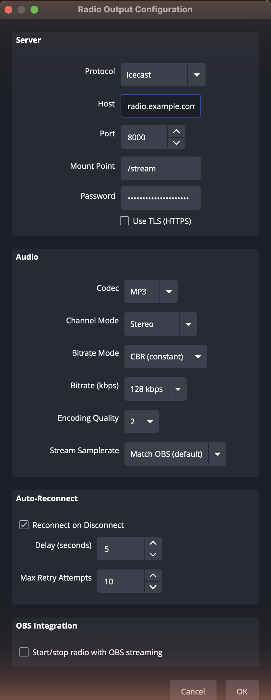
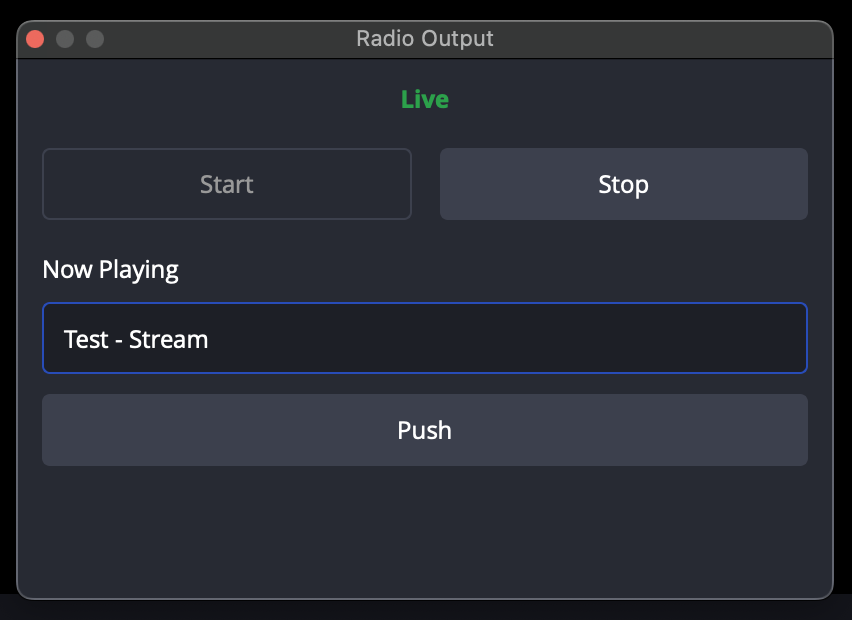
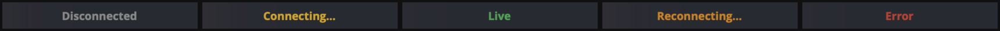

# Radio Output — User Guide

This guide walks you from a fresh install to a live broadcast, then covers the
optional features and the errors you're most likely to hit. If you've used BUTT
(Broadcast Using This Tool), this plugin replaces it — everything happens inside
OBS, with no second app to run.

- [What you need](#what-you-need)
- [1. Install the plugin](#1-install-the-plugin)
- [2. Configure your server](#2-configure-your-server)
- [3. Go live](#3-go-live)
- [4. Optional features](#4-optional-features)
- [5. Confirm the stream is playing](#5-confirm-the-stream-is-playing)
- [Troubleshooting](#troubleshooting)

---

## What you need

- **OBS Studio 28 or newer** (the plugin uses the Qt6 / frontend APIs in modern OBS).
- **An Icecast or SHOUTcast server** you can broadcast to, and its **source credentials**:
  host, port, mount point (Icecast only), and source password. Your station admin
  provides these; if you run your own Icecast, they're in `icecast.xml`.
- A media player such as **VLC** to confirm the stream (optional but recommended).

---

## 1. Install the plugin

> Pre-built installers will be published on the [Releases](https://github.com/tech-noid-systems/obs-radio-output/releases)
> page and in the OBS Plugin Browser once the plugin reaches a stable release.
> Until then, build from source — see [Building from Source](../README.md#building-from-source).

After installing, launch OBS and confirm the plugin loaded:
**Help → Log Files → View Current Log** should contain:

```
[obs-radio-output] plugin loaded successfully
```

You'll also see a **Radio Output…** entry in the **Tools** menu and a **Radio Output**
dock available under **View → Docks**.

---

## 2. Configure your server

Open **Tools → Radio Output…**.

<p align="center">
  
</p>

**Server**

| Field | What to enter |
|-------|---------------|
| **Protocol** | **Icecast** for an Icecast 2.x server (most stations); **SHOUTcast (v1)** for a legacy SHOUTcast/DNAS server. Choosing SHOUTcast hides the Mount Point and TLS rows (the ICY protocol has neither). |
| **Host** | Your server's hostname or IP (e.g. `stream.example.com`). |
| **Port** | The source port. **SHOUTcast note:** enter the *listener* port — the plugin connects the source on port + 1, the historical SHOUTcast convention. So for a server whose stream is on `8000`, enter `8000`. |
| **Mount Point** | Icecast only. The path listeners connect to, e.g. `/stream` or `/live.mp3`. |
| **Password** | Your **source** password (not the admin password). |
| **Use TLS (HTTPS)** | Icecast only. Enable if your server accepts TLS source connections. The plugin fails closed — if the server doesn't actually speak TLS, the connection is refused rather than silently downgraded to plaintext. |

**Audio**

| Field | What to enter |
|-------|---------------|
| **Codec** | **MP3** (universally compatible), **Opus** (efficient, modern players; requires OBS audio at 48 kHz), or **Vorbis** (Ogg). SHOUTcast v1 only carries MP3. |
| **Bitrate** | 128 kbps is a good default for music. Higher = better quality + more bandwidth. |

**Auto-Reconnect** — if enabled, the plugin retries dropped connections. Set the **Delay**
(seconds between attempts) and **Max Retry Attempts**. After the last attempt the output
stops and the dock shows **Error**.

**OBS Integration** — **Start/stop radio with OBS streaming** ties the radio to OBS's
main Start/Stop Streaming button (see [Optional features](#4-optional-features)).

Click **OK**. Settings persist across OBS restarts.

---

## 3. Go live

Open the **Radio Output** dock: **View → Docks → Radio Output**. Dock it anywhere in
your layout.

<p align="center">
  
</p>

Click **Start**. The status label walks through the connection states:

<p align="center">
  
</p>

| Status | Color | Meaning |
|--------|-------|---------|
| **Disconnected** | grey | Idle — not broadcasting. |
| **Connecting…** | amber | Establishing the connection. |
| **Live** | green | Broadcasting. Listeners can tune in. |
| **Reconnecting…** | orange | Connection dropped; auto-reconnect is retrying. |
| **Error** | red | Connection failed (or retries exhausted). Click **Stop** to clear. |

Click **Stop** to end the broadcast.

---

## 4. Optional features

**Now Playing metadata.** While Live, type a title (e.g. `Artist - Track`) into the
dock's **Now Playing** field and click **Push** (or press Return). Listeners' players and
your station's now-playing display update. Push an empty string to clear it.

**Live listener count.** While Live, the dock shows **Listeners: N**, refreshed every
~10 seconds from the server's stats page. It reads `—` when the count isn't available.

**Auto-start with OBS streaming.** Enable **Start/stop radio with OBS streaming** in the
config dialog. Then OBS's main **Start Streaming** button also starts the radio, and **Stop
Streaming** stops it. Two guarantees:

- A radio failure (bad password, server down) **never blocks** your OBS video stream — it
  logs a warning and OBS keeps streaming.
- The dock's **Start/Stop** buttons still work for manual control regardless of the checkbox.

Toggling the checkbox mid-stream applies on the *next* Start Streaming — it won't
retroactively start the radio on an already-running stream.

**Remote control (advanced).** With obs-websocket enabled (built into OBS 28+), external
tools can drive the plugin via `CallVendorRequest` to vendor `obs-radio-output`:
`radio.start`, `radio.stop`, `radio.status`, `radio.pushMetadata`, `radio.applyConfig`,
and `radio.getListeners`.

---

## 5. Confirm the stream is playing

Open your stream's **listener URL** in VLC (**File → Open Network Stream**):

- Icecast: `http://<host>:<port><mount>` — e.g. `http://stream.example.com:8000/stream`
- SHOUTcast: `http://<host>:<port>/` — e.g. `http://stream.example.com:8000/`

You should hear your OBS audio within a few seconds. Your Icecast server's status page
(`http://<host>:<port>/status.xsl`) lists the active mount, its content type, and the
listener count.

---

## Troubleshooting

Check **Help → Log Files → View Current Log** first — the plugin logs a specific reason
for every failure. Common cases:

| Symptom / log line | Likely cause | Fix |
|--------------------|--------------|-----|
| `shout_open() failed: Login failed` / `Invalid password` | Wrong **source** password, or you used the *admin* password. | Re-enter the source password from your server config. |
| `shout_open() failed: Couldn't connect` | Wrong host/port, server down, or firewall. | Verify host and port; confirm the server is reachable (`ping`, or open the status page in a browser). |
| **SHOUTcast** won't connect though host/port look right | SHOUTcast uses **port + 1** for the source. | Enter the *listener* port; the plugin adds 1 for the source. If your server's source port is 8001, enter 8000. |
| `mount … already in use` / source rejected | Another encoder is already connected to that mount. | Stop the other source, or use a different mount. |
| Connects, but **nothing plays in VLC** | Listening on the wrong URL, or codec/container mismatch. | Use the exact listener URL (Icecast includes the mount path). Check the server status page shows your mount as active. |
| `Opus requires 48 kHz audio; OBS is at 44100 Hz` | Opus is 48 kHz-only; OBS is running at 44.1 kHz. | Set **OBS → Settings → Audio → Sample Rate** to **48 kHz** and relaunch OBS, or pick MP3/Vorbis. |
| `SHOUTcast v1 protocol only supports MP3` | You selected Opus or Vorbis with SHOUTcast. | Switch the codec to **MP3**, or use the Icecast protocol. |
| `TLS certificate validation failed` | The server's certificate isn't trusted by your OS (e.g. self-signed). | Use a server with a publicly trusted certificate, or disable **Use TLS**. |
| `shout_open() failed with TLS enabled` | **Use TLS** is on but the server doesn't speak TLS on that port. | Uncheck **Use TLS (HTTPS)**, or point at the server's TLS port. |
| Dock shows **Error** and won't restart | Retries were exhausted; the error is "sticky" by design. | Click **Stop** to acknowledge, fix the cause, then **Start** again. |

Still stuck? Open an issue on the [GitHub Issues](https://github.com/tech-noid-systems/obs-radio-output/issues)
page with your OBS version, OS, and the relevant section of your log.
